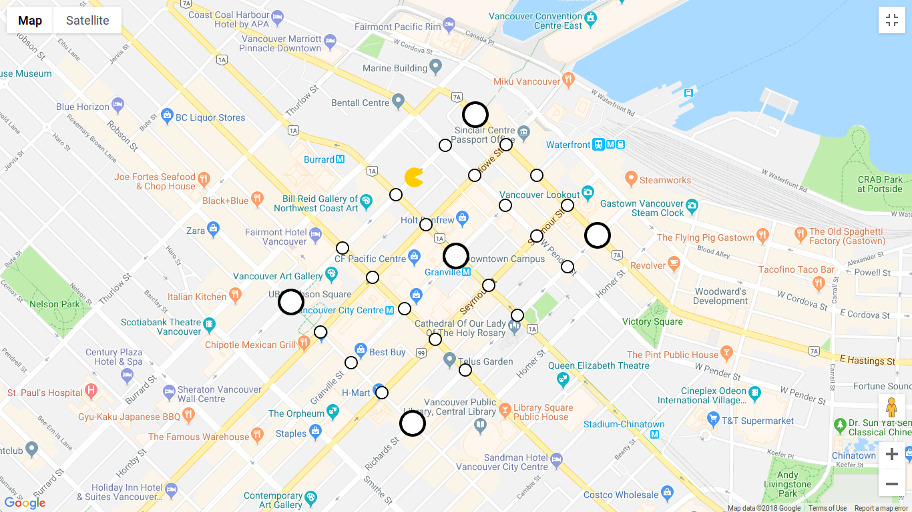

# Pac Macro Mapview

[](https://github.com/pacmacro/pacmacro.github.io/blob/master/LICENSE)

Web application to display the Pac Macro game.

There is a version for the [Ghost team](http://www.sfu.ca/~jyl52/pac-macro/ghost) (which does not normally show the Pacman unless they are in powerup mode) and the [Pacman team](http://www.sfu.ca/~jyl52/pac-macro/pacman) (which will always show the Pacman).



## Alternative Methods of Usage

One way to use the mapview is to download the project and open `index.html` in a browser.

### Electron

An [Electron](https://electronjs.org) application is also available as an option - [download the correct executable for your operating system](https://github.com/pacmacro/pacmacro.github.io/releases).

To start the Electron application locally from the project files, install Electron as a development dependency in the project:
```
npm install --save-dev electron
```

Then start the application:
```
npm start
```

#### Releases

To build the executables, run:
```
./build/release.py
```

The distributables will be created in `build/` as zip files.

## What is Pac Macro?

**Pac Macro** is a game played by the [SFU Computing Science Student Society (CSSS)](http://sfucsss.org/about/csss/) each year at their Frosh events in September. In the game, players run around a 5x5 block rectangle with the objective being similar to the age-old Pacman game - the Ghosts must catch the Pacman.

Teams are broken up into **4 Ghosts and 1 Pacman**, each of which has a **Runner** for each round. The Runners have the Pac Macro app open on their phone to constantly broadcast their location (but cannot see the map), and are navigated by listening to directions on a phone call to their team members. The remaining team members stay in two **Control Rooms** at SFU Vancouver Harbour Centre, watching a map on the Pac Macro app to see the current locations of the Runners and provide directions to their own Runner. Pacman's Control Room team members can see both the Pacman and Ghost Runners; however, the Ghost Control Room team members can only see the Ghost Runners and not the Pacman Runner - unless a Powerdot is eaten. The Pacman team has their individual Control Room so that current locations and plans are confidential.

There are numerous **Pacdots and Powerdots** (the visibly larger Pacdots) scattered around the map which the Pacman must eat. Both provide points to the Pacman, but Powerdots provide more.

When a Powerdot is eaten, **Powerdot mode** is activated. This temporary 30-second mode shows the Pacman Runner's location on the Ghost Control Room screens and allows the Pacman to catch Ghosts, which will mean they are out of the game for that round. Outside of Powerdot mode, however, a Ghost catching the Pacman means that the Pacman loses.

The round ends when one of the following occur:
1. The Ghosts catch Pacman (outside of Powerdot mode),
2. Pacman catches all the Ghosts using Powerdot mode, or
3. Pacman eats all the Pacdots and Powerdots.

At the end of the round, the number of points received by the Pacman team are written on a board. The teams change so that a new team is playing the Pacman role, and a new team member from each team is the new Runner.

At the end of the game, the team with the most points wins.
